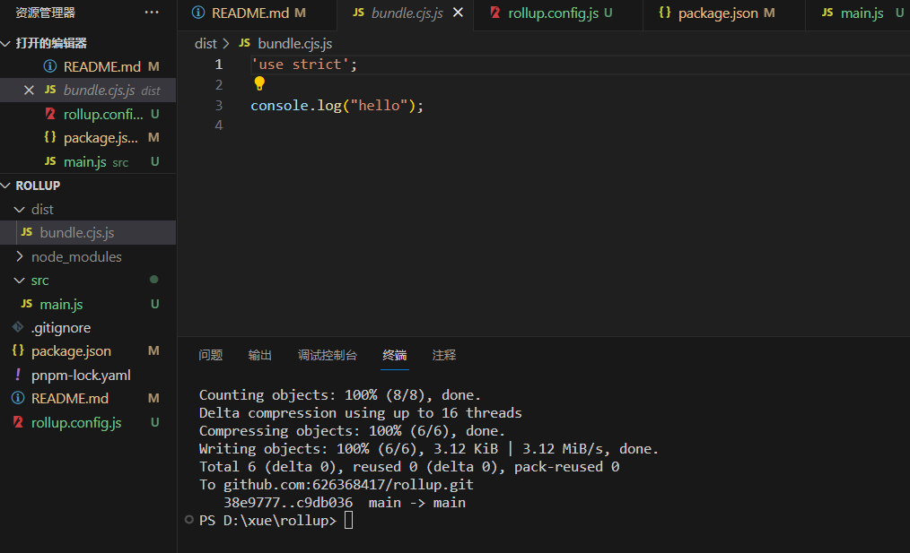

# rollup 学习

## 1. rollup 是什么

Rollup 是一个用于 JavaScript 的模块打包工具，它将小的代码片段编译成更大、更复杂的代码。

vite 是基于 rollup 的，所以学习 rollup 是很有必要的

### ** 基本使用**

**安装**

```js
pnpm  install rollup
```

**创建在根目录 rollup.config.js**

```js
export default {
  //文件入口点
  input: "src/main.js",
  //输出配置
  output: {
    file: "dist/bundle.cjs.js", //输出文件的路径和名称
    format: "cjs", //五种输出格式：amd/es6/iife/umd/cjs
    name: "bundleName", //当format为iife和umd时必须提供，将作为全局变量挂在window下
  },
};
```

**src\main.js**

```js
console.log("hello");
```

**package.json**

因为 rollup.config。使用的是 es 模块，所以需要配置 type 为 module
不然会报错

[!] RollupError: Node tried to load your configuration file as CommonJS even though it is likely an ES module. To resolve this, change the extension of your configuration to ".mjs", set "type": "module" in your package.json file or pass the "--bundleConfigAsCjs" flag.

Original error: Unexpected token 'export'

```js
{
"type": "module",
 "scripts": {
    "build": "rollup --config"
  },
}

```

**打包结果**


### 支持 Babel

使用 Babel 可以将 ES6+ 代码转换为向后兼容的 JavaScript 版本，以便在旧版浏览器中运行。

**安装依赖**

- @babel/core 是 babel 的核心包
- babel/preset-env 是预设
- @rollup/plugin-babel 是 babel 插件

```js
pnpm install @rollup/plugin-babel @babel/core @babel/preset-env --save-dev
```

**src\main.js**

```js
let sum = (a, b) => {
  return a + b;
};
let result = sum(12, 24);
console.log(result);
```

**.babelrc**
.babelrc 文件是 Babel 的配置文件

```js
{
  "presets": [
    [
      "@babel/env",
      {
        // "modules": false 表示不转换模块语法（比如 import 和 export）
        "modules": false
      }
    ]
  ]
}
```

**rollup.config.js**

```js
import babel from "@rollup/plugin-babel";
export default {
  //插件
  plugins: [
    babel({
      //排除node_modules下的文件
      exclude: "node_modules/**",
    }),
  ],
};
```

**打包结果**
这个就是 babel 转换后的结果

```js
"use strict";

var sum = function sum(a, b) {
  return a + b;
};
var result = sum(12, 24);
console.log(result);
```
