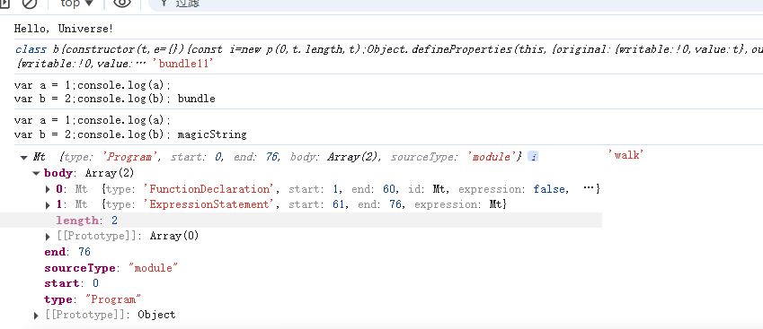

# rollup 源码

## 1. magic-string

magic-string 是一个 JavaScript 库，主要用于高效地创建、修改和生成字符串，特别是在处理源代码的变更时（例如在构建工具或代码转换工具中）。它被广泛应用于 AST（抽象语法树）相关的工具中，尤其是在构建工具和打包工具（如 Rollup）中，来高效地进行代码的插入、替换或删除操作。

**安装 magic-string**

```bash
pnpm install magic-string
```

**使用 magic-string**

```js
import MagicString from "magic-string";

// 创建一个 MagicString 实例
const str = new MagicString("Hello, world!");

// 修改字符串（比如替换内容）
str.overwrite(7, 12, "Universe");

// 获取修改后的字符串
console.log(str.toString()); // "Hello, Universe!"

// 创建一个 MagicString 实例
let magicString1 = new MagicString("var a = 1;");
let magicString2 = new MagicString("var b = 2;");

// 可以对每个实例进行修改操作
magicString1.append("console.log(a);");
magicString2.append("console.log(b);");

// 合并两个 MagicString 实例的字符串内容
let finalResult = magicString1.toString() + "\n" + magicString2.toString();
console.log(MagicString, "bundle11");
console.log(finalResult, "bundle");
```

**常见用途**

- 构建工具：如 Rollup、Webpack 等，magic-string 可以帮助这些工具在构建过程中修改和优化代码。
- 代码转换工具：例如 Babel、TypeScript，magic-string 可用于实现代码的转换和变更（比如，代码的删除、插入或替换）。

## 2. AST

通过 JavaScript Parser 可以把代码转化为一颗抽象语法树 AST,这颗树定义了代码的结构，通过操纵这颗树，我们可以精准的定位到声明语句、赋值语句、运算语句等等，实现对代码的分析、优化、变更等操作

### 2.1 AST 工作流

- Parse(解析) 将源代码转换成抽象语法树，树上有很多的 estree 节点
- Transform(转换) 对抽象语法树进行转换
- Generate(代码生成) 将上一步经过转换过的抽象语法树生成新的代码

### 2.2 acorn

- astexplorer 可以把代码转成语法树
- acorn 解析结果符合 The Estree Spec 规范

**安装 acorn**

```js
pnpm install acorn --save
```

**使用 acorn**

```js
import { parse } from "acorn";
const soureCode = `
function hello(name) {
    console.log('Hello, ' + name);
}
hello('World');`;

const ast = parse(soureCode, {
  ecmaVersion: 2020, // 使用 ECMAScript 2020 版本
  sourceType: "module", // 代码类型为模块
  // plugins: { jsx: true },  // 启用 JSX 解析
  // locations: true,         // 添加位置信息
  // ranges: true             // 添加起始和结束位置
});

export default ast;
```



### 2.3 Rollup 中的 AST 作用：

- 代码分析和转换: Rollup 通过解析输入文件，构建其 AST，这样就能了解源代码的结构。它可以基于 AST 进行各种转换，如模块的合并、ES6+ 特性转换为兼容的 JavaScript 代码等

- 代码优化: Rollup 可以通过分析 AST，对代码进行优化，如删除未使用的代码、合并变量声明等，以减小输出文件的大小。

- 插件接口: Rollup 插件可以访问和操作 AST 来实现自定义的转换操作。通过插件，开发者可以在构建过程中进行定制化的代码修改
